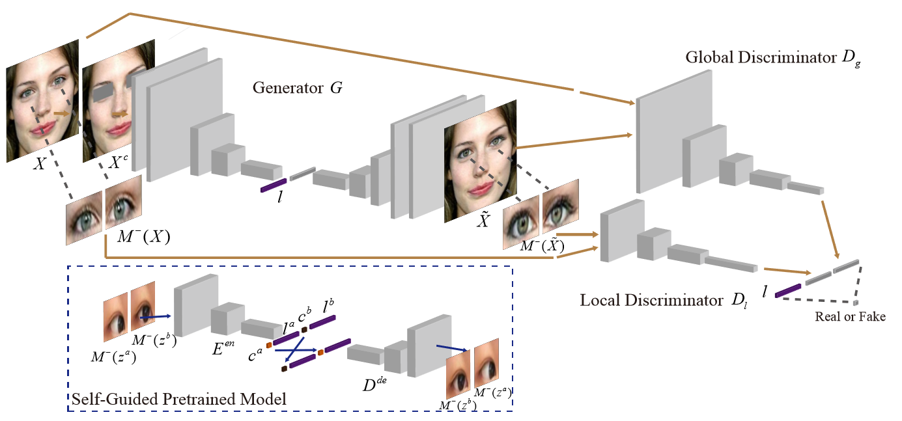

# GazeCorrection: Self-Guided Eye Manipulation in the wild using Generative Adversarial Networks
The code of paper "GazeCorrection: Self-Guided Eye Manipulation in the wild using Generative Adversarial Networks". Paper will published coming soon.

--------------------------------------------


# Introduction

Gaze correction aims to redirect the person’s gaze intothecamerabymanipulatingtheeyeregion,and it can be considered as a specific image resynthesis problem. Gaze correction has a wide range of applications in real life, such as, the eye contract of remote users in video conference systems. In this paper, we propose a novel method which is based on the inpainting model to learn from the face image to filling-in eye regions with new contents representing corrected eye gaze. Moreover, our model does not require the training dataset labelled with the specific head pose and eye angle information; thus, the training data is easy to collect. To retain the identity information of the eye region in the original input, we propose a self-guided pretrained model to learn the angle-invariance feature. Experiments show our model achieves very compelling gaze-correction results in the wild dataset which is collected from the website and will be introduced in details.

## Network Architecture




## 

## Dependencies
* [Python 2.7](https://www.python.org/download/releases/2.7/)
* [Tensorflow 1.4+](https://github.com/tensorflow/tensorflow)


## Usage

- Clone this repo:
```bash
git clone https://github.com/zhangqianhui/Eye_Rotation_GAN.git
```
- Download the Eye_Rotation dataset

Coming soon!!!

- Train the model using the default parameter
```bash
python main.py 
```


            
# Reference code

- [Sparsely_Grouped_GAN](https://github.com/zhangqianhui/Sparsely-Grouped-GAN)

- [DCGAN tensorflow](https://github.com/carpedm20/DCGAN-tensorflow)

- [Spectral Norm tensorflow](https://github.com/taki0112/Spectral_Normalization-Tensorflow)

- [Exemplar-GAN-Eye-Inpainting-Tensorflow](https://github.com/zhangqianhui/Exemplar-GAN-Eye-Inpainting-Tensorflow.git)

- [ELEGANT](https://github.com/Prinsphield/ELEGANT)
